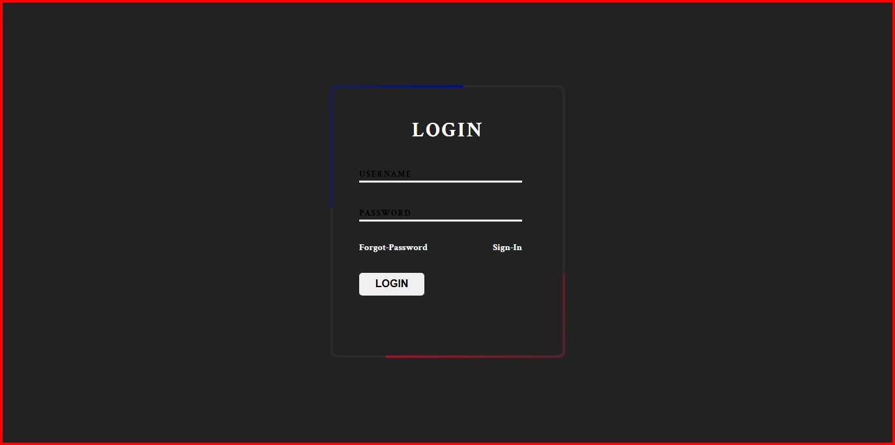

# Login Page UI By Ghaem Shafi
> **A Simple But Attractive Login Page For Users**
---
## **Features⬇️**
- ✅ *Simple design*
- ✅ *Beautiful user interface*
- ✅ *Special design*
- ✅ *Attractive animation*
---

## 🛠️Technologies used
- 🌐 **HTML5**
- 🎨 **Modern CSS (Flexbox , grid , animation , variables)**

---

## About Me🧑🏻‍💻

> i'm **Ghaem Shafi** a self-taught front-end developer passionate about creating clean and interactive user interfaces currently focused on building real-world projects with **🌐HTML** , **🎨CSS** and **🚀javascript**.   🛠️Always learning   🚀Always building   follow my journey here 🔜 [[my-account]](https://github.com/richmond-city?tab=repositories)

